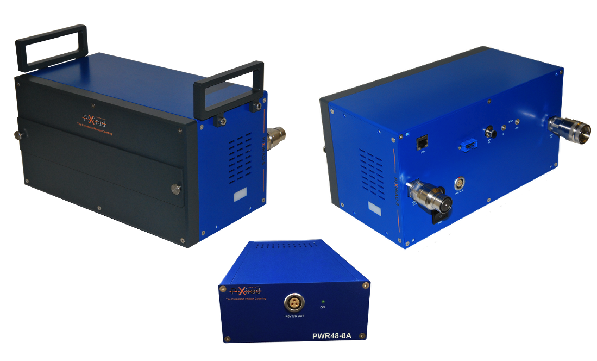
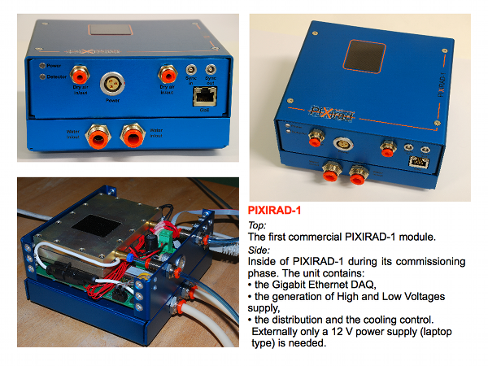

.. _camera-pixirad:

PIXIRAD (PX1 and PX8) camera plugin
-----------------------------------






Compilation and installation:
```````````````````````````````````````````````````````````````````````````````````

In file config.inc :

COMPILE_PIXIRAD=1

Then, 

.. code-block:: sh

 make config
 make 
 make -C sip
 make install


=== Basic network config ===
````````````````````````````````````````````````````````````````````````````````````````````````````````````````````````````````````````````````````````````````````````````

The camera has 192.168.0.1/24 adress. The detector pc has to be configured likewise.
The recommended option is to have one good quality network interface dedicated to the pixirad, and one for the rest of the world.

Case one (Recommended):
Dedicated interface:

.. code-block:: sh

   auto eth1
   iface eth1 inet static
   address 192.168.0.100
   netmask 255.255.255.0
   mtu 1500


Case two, one interface, with a router handling two subnetworks:
Configuration with an alias on interface eth0:

.. code-block:: sh

   auto eth0:1
   iface eth0:1 inet static
   address 192.168.0.100
   netmask 255.255.255.0
   mtu 1500

            
            
            
            
            
Test examples
````````````````````````````````````````````````````````````````````````````````````````````````````````````````````````````````````````````````````````````````````````````        
            
With python 
````````````````````````````````````````````````````````````````````````````````````````````````````````````````````````````````````````````````````````````````````````````    
Test directly the camera within python:


.. code-block:: python

   from Lima import Core
   from Lima import Pixirad as PixiradAcq
   


# Set the number of image treatment threads according to the number of CPU available on your mighty machine :

.. code-block:: python

   Core.Processlib.PoolThreadMgr.get().setNumberOfThread(20)


# Create your camera with its network settings and model (PX8 or PX1)

.. code-block:: python

   print "\n\n\n\n ======= INIT ======== \n"
   camera = PixiradAcq.Camera("192.168.0.1", 2222, "PX8")
   camera.init() 


.. code-block:: python

   print "\n\n\n\n ======= INTERFACE ======== \n"
   camera_interface = PixiradAcq.Interface(camera)
   # Set some feature (check manual) 
   # color mode (only 1 col mode supported)
   camera_interface.setColorMode(camera.COLMODE_1COL0)
   # Set point (more than acheavable by the peliter to have full powa):
   camera.setCoolingTemperatureSetpoint(-50) 
   # Set some energy thresholds (check manual, as they will fall in gain level (ranges of energy).
   camera.setLowThreshold0(10)
   camera.setHighThreshold0(60)
   camera.setLowThreshold1(10)
   camera.setHighThreshold1(60)
   # Some high tension management 
   camera.setHighVoltageBiais(2100)
   camera.setHVBiasModePower(1)
   camera.setHighVoltageDelayBeforeOn(3)
   camera.setHVRefreshPeriod(1000);
   # some ethernet interface 
   camera_interface.setTrsfMode(camera.UNMOD)


.. code-block:: python

   # Get control over things:
   print "\n\n\n\n ======= CONTROL ======== \n"
   control = Core.CtControl(camera_interface)
   # set how much you want lima to buffer memory for treatment.
   control.buffer().setMaxMemory(70)


.. code-block:: python

   # Get the object with whom you will play :
   print "\n\n\n\n ======= ACQUISITION OBJECT ======== \n"
   acq = control.acquisition()
   # Define trigger:
   acq.setTriggerMode(Core.IntTrig)
   #acq.setTriggerMode(Core.ExtTrigMult)


.. code-block:: python

   # save somewhere
   saving = control.saving()
   pars=newsaving.getParameters()
   pars.directory='/tmp/test'
   pars.prefix=basename
   pars.suffix='.edf'
   pars.fileFormat=Core.CtSaving.EDF
   pars.savingMode=Core.CtSaving.AutoFrame
   saving.setParameters(pars)


.. code-block:: python

   # Take images !
   # expo time for one frame :
   acq.setAcqExpoTime(0.01)
   # number of frames:
   acq.setAcqNbFrames(10)
   # get it !
   control.prepareAcq(); 
   control.startAcq()

.. code-block:: python

   # pretty ones now !
   # Take many (100) images and accumulate them to have better stats and one image written:
   acq.setAcqMode(Core.Accumulation)
   # Max expo time per frame:
   acq.setAccMaxExpoTime(0.01)
   # Total time for the accumulation:
   acq.setAcqExpoTime(1);
   # how many accumulated images:
   acq.setAcqNbFrames(1)
   # get them all and keep one:
   control.prepareAcq(); 
   control.startAcq()


Tango
````````````````````````````````````````````````````````````````````````````````````````````````````````````````````````````````````````````````````````````````````````````    

### Tango DS musts:
#properies 
.. code-block:: sh

   initial_model = PX8   // or PX1
   ip_address 192.168.0.1
   port number 2222


### pyTango DS examples :

.. code-block:: python

   import PyTango
   pixi = PyTango.DeviceProxy("d05/pixirad/pixirad")
   limaccd = PyTango.DeviceProxy("d05/pixirad/pixirad8")
   pixi.cooling_temperature_setpoint = -50
   pixi.high_voltage_biais = 2100
   pixi.dead_time_free_mode = 'DEAD_TIME_FREE_MODE_OFF'
   pixi.color_mode = 'COLMODE_1COL0'
   pixi.low_threshold0 =  1
   pixi.high_threshold0 = 99
   pixi.low_threshold1 =  1
   pixi.high_threshold1 = 99
   #pixi.sensor_config_build = 'PX8'
   pixi.h_v_bias_mode_power = 1
   pixi.trsf_mode = "UNMOD"
   limaccd.buffer_max_memory = 80	
   limaccd.acq_nb_frames = 0
   limaccd.acq_expo_time = 0.01
   limaccd.prepareAcq()
   limaccd.startAcq()


            
            
            
            
            
            
            
            
            
            
            
            
            
            
            

=== Advanced system and network tuning (OPTIONAL) ===
````````````````````````````````````````````````````````````````````````````````````````````````````````````````````````````````````````````````````````````````````````````

The camera will send the images as small (1490) udp datagrams, as fast as it can, nearly saturating the bandwidth of the 1Gb ethernet link.
Bad network cards, or high latency systems will result in a loss of part of the image. 
If this happens, several points needs checking. The ethernet card driver might drop packets (and as they are UDP, there won't be any chace to see them). 
The linux kernel UDP buffer might saturate and willingly drop packets (but you knows it at least). In this case, it means that your reading loop (reading from the linux udp buffer) is too slow.


Using FIFO realtime mode can help.
Tuning network buffers can help.
Changing ethernet card can save your skin, and avoid you loosing weeks fine tuning muddy cards.

== Realtime mode (OPTIONAL) ==
````````````````````````````````````````````````````````````````````````````````````````````````````````````````````````````````````````````````````````````````````````````

In : /etc/security/limits.conf 
Add : 

.. code-block:: sh

   username    -       rtprio  5

In soft :

.. code-block:: cpp

   pthread_t this_thread = pthread_self(); 
   struct sched_param params;     
   params.sched_priority = 5; 
   ret = pthread_setschedparam(this_thread, SCHED_FIFO, &params);
   if (ret != 0) { std::cout << "Check /etc/security/limits.conf " << std::endl; }

  
UDP debug tips
``````````````
  If you suspect drop of UDP datagram due to a too small kernel buffer (the plugin is too slow to treat the buffer, it filled and drop frames)
  
.. code-block:: sh

  cat /proc/net/udp
  
  And check the drop column.
  
.. code-block:: sh

  cat /proc/sys/net/core/rmem_max  

  tells you the buffer size 
  by default : 131071
  
  Enough for 100 images:
  
.. code-block:: sh

  net.core.rmem_max = 507217408

  
== Kernel tuning (OPTIONAL)==
````````````````````````````````````````````````````````````````````````````````````````````````````````````````````````````````````````````````````````````````````````````
man udp

Change in /etc/sysctl.conf and validate with sysctl -p

.. code-block:: sh

   net.core.rmem_max = 256217728
   net.core.wmem_max = 256217728
   net.ipv4.udp_mem = 131072 262144 524288
   net.ipv4.udp_rmem_min = 65536
   net.core.netdev_max_backlog = 65536 
   net.core.somaxconn = 1024


== Network card driver tuning (OPTIONAL)==
````````````````````````````````````````````````````````````````````````````````````````````````````````````````````````````````````````````````````````````````````````````
.. code-block:: sh

   ethtool -g eth1
   Ring parameters for eth1:
   Pre-set maximums:
   RX:		4096
   RX Mini:	0
   RX Jumbo:	0
   TX:		4096
   Current hardware settings:
   RX:		512         <<<<<< =====
   RX Mini:	0
   RX Jumbo:	0
   TX:		512

Increased with :

.. code-block:: sh

   ethtool -G eth1 rx 4096


=== Possible problems with network ===
````````````````````````````````````````````````````````````````````````````````````````````````````````````````````````````````````````````````````````````````````````````


== List of known to work cards ==
= Embedded motherboard card on optiplex 980:
Intel Corporation 82578DM Gigabit Network Connection (rev 05)

== List of non working cards ==
= Intel pro 1000 on PCI card (82541GI) (debian 7 & 9):
Intel Corporation 82541GI Gigabit Ethernet Controller
Intel Corporation 82541PI Gigabit Ethernet Controller (rev 05)


=== Possible problems with Chillers ===
````````````````````````````````````````````````````````````````````````````````````````````````````````````````````````````````````````````````````````````````````````````
Symptoms : strippy images

The goal is to setup your temperature settings as to have the peltier full time @ max power.
If the peltier is regulating the temperature, stripes appears in the images.
A easy way is to setup a -50C unreachable goal for the detector and let it stabilise to wathever temperature it can reach based on chiller setting.
Chiller is supposed to be set at 16degC. Going bellow needs a hutch humidity well controlled.


